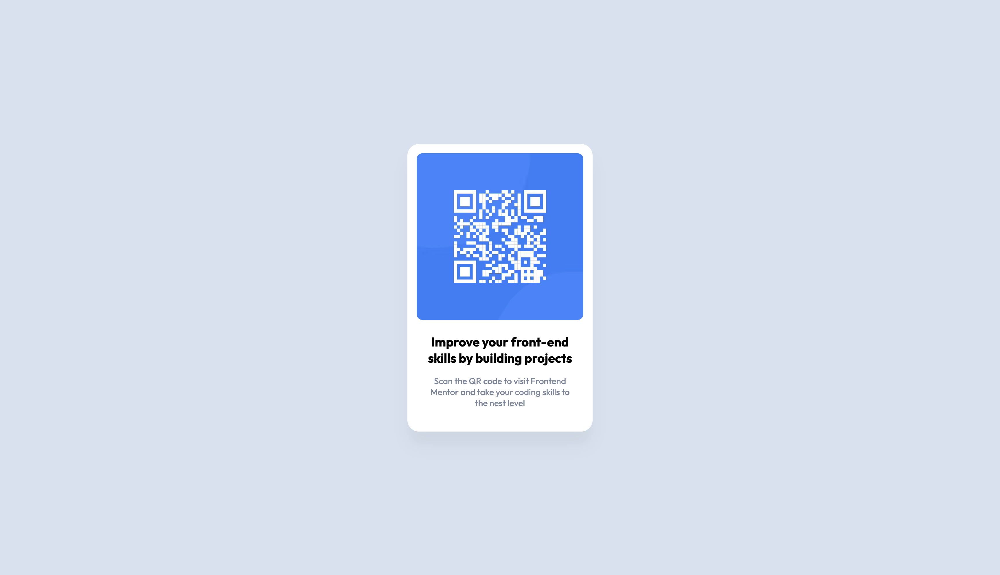

# Frontend Mentor - QR code component solution

This is a solution to the [QR code component challenge on Frontend Mentor](https://www.frontendmentor.io/challenges/qr-code-component-iux_sIO_H).

## Table of contents

- [Frontend Mentor - QR code component solution](#frontend-mentor---qr-code-component-solution)
  - [Table of contents](#table-of-contents)
  - [Carga inicial del proyecto](#carga-inicial-del-proyecto)
    - [Node.js](#nodejs)
    - [Gulp](#gulp)
  - [Instalación de dependencias](#instalación-de-dependencias)
  - [Overview](#overview)
    - [Screenshot](#screenshot)
    - [Links](#links)
  - [My process](#my-process)
    - [Built with](#built-with)
  - [Author](#author)

## Carga inicial del proyecto

### Node.js
Before you begin, make sure you have **Node.js** installed on your computer, as you'll need npm (Node Package Manager) to manage the project's dependencies.

You can download and install Node.js from [node.js](https://nodejs.org/en).

### Gulp
You'll need **Gulp** to automate tasks in your project. You can install it globally on your system using npm (Node Package Manager):

```bash
npm install --global gulp-cli
```

## Instalación de dependencias
Once you have Node.js and Gulp installed, you can proceed to install the specific dependencies for your project. Use the following command to install all the necessary dependencies:

```bash
sudo npm install gulp gulp-sourcemaps gulp-sass gulp-postcss autoprefixer cssnano sass gulp-avif gulp-webp gulp-imagemin gulp-purgecss @fullhuman/postcss-purgecss gulp-concat @fortawesome/fontawesome-free gulp-uglify gulp-strip-comments --save-dev
```
Make sure to run this command in the root directory of your project.

These steps will allow you to set up your development environment properly and obtain all the necessary dependencies for your project.

## Overview

### Screenshot



### Links

- GitHub 🐈 : [devpullcode/fm-gr-code-component](https://github.com/devpullcode/fm-qr-code-component)
- Site 🔗 : [github.io/fm-gr-code-componet](https://devpullcode.github.io/fm-qr-code-component/)

## My process

### Built with

- Semantic HTML5 markup
- SCSS custom properties
- Flexbox
- Mobile-first workflow
- [Node](https://nodejs.org/es)
- [Gulp](https://gulpjs.com)

## Author
- Name - Jose Antonio González Santos
- Nick - devpullcode

## Contacto
- 🌐 Sitio Web: [www.devpullcode.dev](https://www.devpullcode.dev)
- 📧 Email: contact@devpullcode.dev
- 🔗 Linkedin:  [Jose Antonio González Santos](https://www.linkedin.com/in/jose-antonio-gonzález-santos-884153235?lipi=urn%3Ali%3Apage%3Ad_flagship3_profile_view_base_contact_details%3B22o01BakQ%2Be4Qh5FUTqErg%3D%3D)
- 🅧 Twitter: [@devpullcode](https://twitter.com/devpullcodelive)
- 👨‍💻 GitHub: [github.com/devpullcode](https://github.com/devpullcode)
